# Architecture

```mermaid
flowchart LR
    subgraph Source
        K[("Kaggle CSV<br/>eCommerce Behavior")]
        G[["Synthetic Generator<br/>scripts/generate_sample_data"]]
    end

    subgraph ETL["ETL Pipeline (src/etl)"]
        L[load.py] --> C[clean.py] --> T[transform.py] --> P[pipeline.py]
    end

    subgraph Storage
        PG[("PostgreSQL<br/>star schema")]
        PQ[("Parquet mirror<br/>data/processed")]
    end

    subgraph Analytics["Analytics (src/analytics)"]
        MET[metrics]
        FUN[funnel]
        COH[cohort]
        SEG[segmentation]
        FEA[feature_adoption]
        RCA[root_cause]
        ABT[ab_testing]
    end

    subgraph ML["ML (src/ml)"]
        CH[churn_model<br/>LogReg · RF · XGBoost]
    end

    subgraph AI["AI Layer (src/ai)"]
        CO[copilot<br/>OpenAI / Gemini / offline]
    end

    subgraph App["Streamlit Dashboard (app)"]
        UI[9 analytics pages]
    end

    K --> L
    G --> L
    P --> PG
    P --> PQ
    PG --> Analytics
    PQ --> Analytics
    Analytics --> UI
    Analytics --> ML
    ML --> UI
    Analytics --> AI
    ML --> AI
    AI --> UI
```

## Layers

| Layer | Tech | Responsibility |
|-------|------|----------------|
| Ingestion | Python, Pandas | Load raw CSV / generate synthetic events |
| Storage | PostgreSQL + Parquet | Star-schema warehouse + offline mirror |
| Analytics | Pandas, NumPy, SciPy, Statsmodels | Funnel, cohort, segmentation, RCA, A/B |
| ML | scikit-learn, XGBoost | Churn prediction & feature importance |
| AI | OpenAI / Gemini | Grounded natural-language insights |
| Presentation | Streamlit, Plotly | Multi-page SaaS dashboard |
| Delivery | Docker, GitHub Actions | Containerisation & CI |

The platform runs in two modes:
- **Full mode** — PostgreSQL is reachable; tables are written to and read from the warehouse.
- **Offline mode** — no database; everything reads the Parquet mirror, so the demo
  works on any laptop with zero infrastructure.
