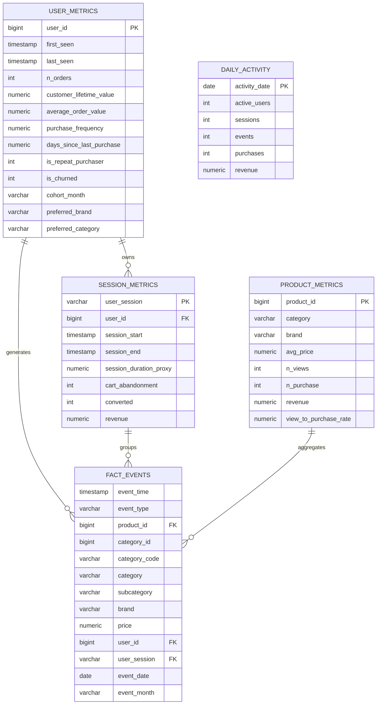

# Entity-Relationship Diagram

The warehouse uses a star schema centred on `fact_events`, with derived metric
tables materialised by the ETL.

## Grain

| Table | Grain | Key |
|-------|-------|-----|
| `fact_events` | one row per event | composite |
| `user_metrics` | one row per user | `user_id` |
| `session_metrics` | one row per session | `user_session` |
| `product_metrics` | one row per product | `product_id` |
| `daily_activity` | one row per day | `activity_date` |
